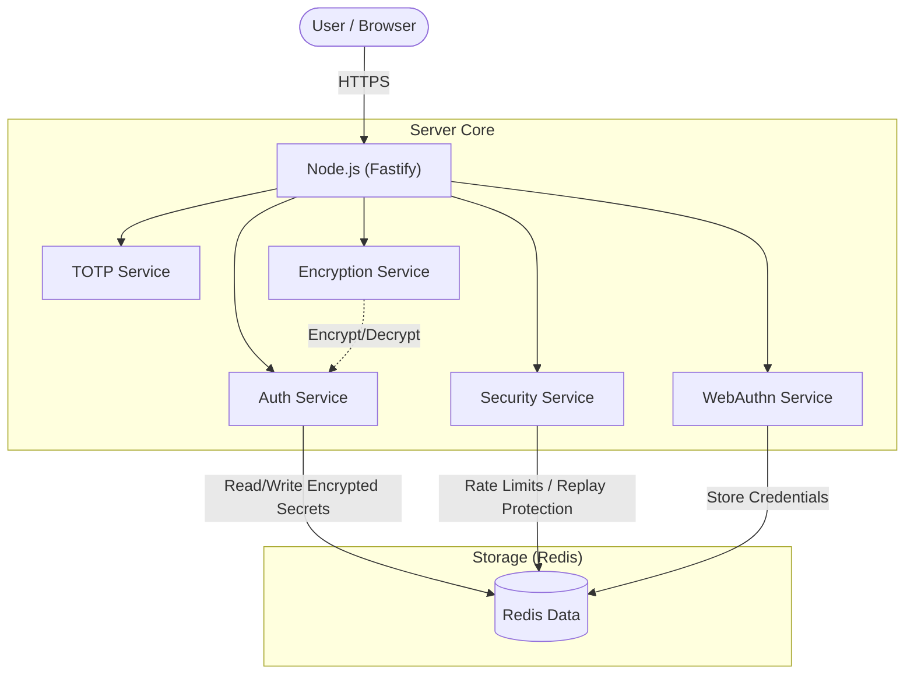

# Sistema de Autenticação (TOTP + Passkeys) - Security by Design

Este projeto implementa um sistema de Autenticação Multi-Fator (MFA) suportando **TOTP** (RFC 6238) e **WebAuthn/Passkeys** (FIDO2), seguindo rigorosamente os padrões de segurança da indústria e especificações IETF.

Desenvolvido com foco em segurança ("Security by Design"), performance e privacidade.

## 🏗️ Arquitetura da Solução



## 🚀 Tecnologias

*   **Node.js (v20+) & TypeScript**: Backend performático e tipado.
*   **Fastify**: Framework web de alta performance (v5).
*   **Redis**: Armazenamento de estado volátil, segredos (encriptados) e controle de segurança.
*   **WebAuthn/FIDO2**: Autenticação sem senha (TouchID, FaceID, Windows Hello).
*   **AES-256-GCM**: Criptografia de dados sensíveis em repouso.

## 🛡️ Funcionalidades de Segurança

1.  **Criptografia em Repouso**: Segredos TOTP são encriptados com AES-256-GCM antes de serem salvos no Redis.
2.  **Proteção de Replay Estrita**: Bloqueio baseado em Time-Step (janela de 30s) impede reutilização de tokens.
3.  **Privacidade (Account Enumeration)**: Respostas genéricas (`401 Credenciais inválidas`) impedem a descoberta de usuários existentes.
4.  **Sessão Segura**: Cookies `HttpOnly`, `Secure` e `SameSite=Strict` após autenticação.
5.  **Auto-Remoção de Inatividade**: Dados de usuários inativos por 50 dias são automaticamente excluídos (TTL).
6.  **WebAuthn Standards**: Validação rigorosa de Origin, RPID e Challenge.
7.  **Rate Limiting**: Proteção contra força bruta (5 tentativas/5min com backoff exponencial).
8.  **Hardening HTTP**: Headers de segurança via `@fastify/helmet`.

## 📦 Como Rodar

### Pré-requisitos
*   Docker e Docker Compose
*   Node.js (v20+)

### Passo a Passo

1.  **Clone o repositório**
    ```bash
    git clone <seu-repositorio>
    cd otp-system
    ```

2.  **Suba a infraestrutura**
    ```bash
    docker-compose up -d
    ```

3.  **Configure o Ambiente**
    Crie o arquivo `.env`:
    ```bash
    cp .env.example .env
    ```
    > **Importante**: Gere chaves seguras para `ENCRYPTION_KEY` (32 bytes hex) e `SESSION_SECRET`.

4.  **Instale e Rode**
    ```bash
    npm install
    npm run dev
    ```

5.  **Acesse**: `http://localhost:3000`

## 🧪 Desenvolvimento

A pasta `scripts/` contém utilitários para manutenção e migração:
- `migrate-encryption.ts`: Criptografa usuários legados.
- `migrate-ttl.ts`: Aplica política de expiração (50 dias).

> **Nota**: Testes e relatórios de verificação não são incluídos no repositório por questões de segurança e limpeza.

## ⚠️ Notas de Produção

- **HTTPS**: É obrigatório para WebAuthn e Cookies Secure. Em localhost funciona, mas em produção use um Reverse Proxy (Nginx/Traefik) com SSL.
- **Configuração**: Garanta que `WEBAUTHN_ORIGIN` corresponda exatamente ao seu domínio.
