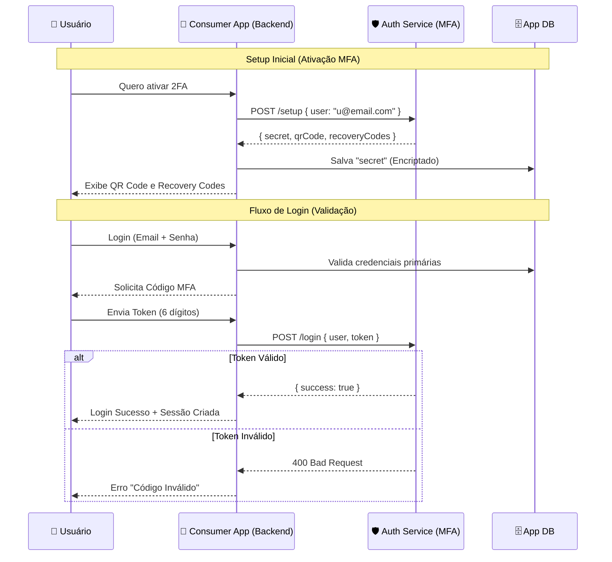

# Sistema de Autenticação (TOTP + Passkeys) - Security by Design

Este projeto implementa um sistema de Autenticação Multi-Fator (MFA) moderno, suportando **TOTP** (RFC 6238) e **WebAuthn/Passkeys** (FIDO2).

**Destaques:**
- 🔒 **Security by Design**: Criptografia AES-256 em repouso, proteção contra replay, rate limiting.
- 🐳 **Docker Native**: Infraestrutura completa containerizada (App + Redis + Nginx).
- 🎨 **Premium UI**: Interface moderna com Dark Mode e Glassmorphism.

## 🏗️ Arquitetura de Referência

A solução adota uma arquitetura de "Defense in Depth", onde cada camada possui responsabilidades de segurança específicas.


---

## 🛠️ Modo Dev vs Prod

O sistema possui "Break-glass Flags" para facilitar o desenvolvimento, mas que **devem ser evitados em produção**.

| Variável | Padrão (Prod) | Descrição | Risco |
|----------|---------------|-----------|-------|
| `NODE_ENV` | `production` | Define otimizações e checagens de segurança. | Alto se != production |
| `ALLOW_DEBUG_SETUP_OUTPUT` | `false` | Se `true`, `/setup` retorna `secret` em texto puro. | **Crítico** (Vazamento de Secret) |
| `ENABLE_DEV_VERIFY_ENDPOINT` | `false` | Se `true`, habilita `/verify`. | Alto (Bypass de Sessão) |
| `I_KNOW_WHAT_IM_DOING` | `false` | **Obrigatório** estar `true` para ativar qualquer flag debug acima em Prod. | Trava de Segurança |

---

## ✅ Go-Live Checklist (Produção)

Antes de ir para produção, verifique:

1.  [ ] **HTTPS Ativo**: O serviço roda atrás de um proxy (Nginx/AWS ALB) com SSL.
2.  [ ] **Environment**: `NODE_ENV=production`.
3.  [ ] **Encryption Key**: `ENCRYPTION_KEY` definida (32 bytes hex) e **segura**.
4.  [ ] **Secrets**: `SESSION_SECRET` forte e único.
5.  [ ] **CORS**: `FRONTEND_ORIGIN` configurado corretamente (ex: `https://app.com`).
6.  [ ] **WebAuthn**: `WEBAUTHN_REQUIRE_UV=true` (Recomendado) e `WEBAUTHN_ORIGIN` correto.
7.  [ ] **Debug Flags**: Todas as flags `ALLOW_DEBUG...` removidas ou `false`.
8.  [ ] **Redis**: Senha configurada (`REDIS_PASSWORD`) se não estiver em rede isolada.

---

## 🚀 Tecnologias

| Componente | Tecnologia | Função |
|------------|------------|--------|
| **Backend** |   | Lógica de negócios e API segura. |
| **Framework** |  | Servidor web de alta performance. |
| **Database** |  | Sessões, Rate Limiting e Segredos (Encriptados). |
| **Infra** |   | Containerização e Proxy Reverso. |
| **Auth** |  | Autenticação Biométrica FIDO2. |

## 🛡️ Funcionalidades de Segurança (Deep Dive)

Abaixo detalhamos as implementações de segurança para fins educativos:

1.  **Criptografia em Repouso**: Segredos TOTP nunca são salvos em texto plano. Utilizamos **AES-256-GCM** com uma chave de 32 bytes (`ENCRYPTION_KEY`) antes da persistência no Redis.
2.  **Proteção de Replay Atômica**: Prevenimos reutilização de tokens OTP usando uma chave `replay:{userId}:{step}` no Redis com operação atômica `SET NX`.
3.  **Privacidade (Account Enumeration)**:
    - Respostas genéricas (`401 Credenciais inválidas`).
    - **Timing Attack Protection**: Delay artificial constante (ex: 200ms) em *todas* as falhas de autenticação.
4.  **Sessão Segura**: 
    - IDs de sessão aleatórios (UUIDv4).
    - Cookie `session` assinado, `HttpOnly`, `Secure` e `SameSite=Strict` (ou `Lax` dependendo do fluxo).
5.  **Auto-Remoção de Inatividade**: Dados de usuários inativos são automaticamente expurgados do Redis via TTL (Time-To-Live).
6.  **WebAuthn Hardening**: Validação estrita de Challenge e Integridade de Counters para evitar clonagem de autenticadores.
7.  **Rate Limiting Duplo**:
    - **Por IP**: Proteção contra DDoS/Brute-Force.
    - **Por Usuário**: Proteção contra Credential Stuffing.
8.  **Hardening HTTP (Nginx + Helmet)**:
    - **Nginx**: Atua como *TLS Termination Proxy*, removendo a carga de criptografia da aplicação Node.js.
    - **CSP (Content Security Policy)**: Prevenção de XSS.

## 📦 Como Rodar (Local)

Utilizamos Docker Compose para simular o ambiente de produção.

1.  **Configure o Ambiente**:
    ```bash
    cp .env.example .env
    ```
    > Ajuste `WEBAUTHN_ORIGIN=http://localhost` para rodar localmente via Nginx.

2.  **Suba a infraestrutura**:
    ```bash
    docker-compose up -d --build
    ```

3.  **Acesse**:
    👉 **http://localhost** (Porta 80)
    
    *O Nginx redirecionará internamente para o Node.js na porta 3000.*

## 🔌 Arquitetura de Integração (Como Consumir)

Este serviço foi projetado para operar como um **Microserviço de Autenticação** independente. Sua aplicação principal ("Consumer App") delega a responsabilidade de MFA e Passkeys para ele via API REST.

### Fluxo de Validação (Sequence Diagram)

O diagrama abaixo ilustra como uma aplicação legada ou nova deve consumir este serviço para validar um login:

```mermaid
sequenceDiagram
    participant User as 👤 Usuário
    participant Frontend as 📱 Sua App (Frontend)
    participant Backend as ⚙️ Sua App (Backend)
    participant Auth as 🛡️ Auth Service (Este Projeto)

    User->>Frontend: Digita Login + Senha
    Frontend->>Backend: POST /login (credenciais básicas)
    Backend->>Backend: Valida Senha (LDAP/DB)
    
    rect rgb(20, 20, 20)
        note right of Backend: 🔓 Início do Fluxo MFA
        Backend-->>Frontend: 200 OK (Requer 2FA)
        
        Frontend->>User: Solicita Token TOTP ou Biometria
        User->>Frontend: Insere Token / TouchID
        
        Frontend->>Backend: POST /verify-2fa { token, user }
        
        Backend->>Auth: POST /verify (backend-to-backend)
        Note over Backend,Auth: Payload: { token, secret, user }
        Auth-->>Backend: { success: true }
    end
    
    Backend->>Frontend: 200 OK (Login Completo + JWT)
    Frontend->>User: Redireciona para Dashboard
```



### Arquitetura de Referência (Integração com App Externa)

Este diagrama ilustra como sua aplicação (Consumer App) deve interagir com o Auth Service em um cenário de **Backend-to-Backend**.



### Endpoints Principais para Integração

| Método | Endpoint | Descrição | Status em Prod |
|--------|----------|-----------|----------------|
| `POST` | `/setup` | Gera Segredo TOTP, QR Code e Uri. | **Restrito** (Segredos ocultos por padrão) |
| `POST` | `/login` | Valida Token e cria sessão. | **Ativo** (Recomendado para Prod) |
| `POST` | `/verify` | Valida um token TOTP (stateless). | **Desabilitado** (Apenas Dev/Test) |

> **Nota**: Para habilitar o output completo de `/setup` ou o endpoint `/verify` em produção (não recomendado), use as variáveis de ambiente `ALLOW_DEBUG_SETUP_OUTPUT=true` e `ENABLE_DEV_VERIFY_ENDPOINT=true`.

## 📚 API Reference (Exemplos)

### 1. Setup (Gerar Credenciais)
Chamado pelo seu Backend quando o usuário ativa o 2FA.

**Request:** `POST /setup`
```json
{
  "user": "usuario@exemplo.com"
}
```

**Response (Prod - Padrão):**
```json
{
  "qrCode": "data:image/png;base64,iVBORw0KGgo...", // Exibir no Frontend
  "recoveryCodes": ["A1B2-C3D4", "E5F6-G7H8", ...] // Backup para o usuário
}
```
> **Nota de Segurança**: Em Produção, `secret` e `otpAuth` **não são retornados** para evitar vazamento. Se precisar deles para debugging, veja a seção [Modo Dev vs Prod](#modo-dev-vs-prod).

### 2. Verify (Test Only / Legacy)
⚠ **Atenção**: Este endpoint é **desabilitado por padrão em produção** (retorna 404). Use o endpoint `/login` para validação real.

**Request:** `POST /verify`
```json
{
  "user": "usuario@exemplo.com",
  "token": "123456",
  "secret": "JBSWY3..." // Em Prod isso não está disponível no client!
}
```

**Response:**
```json
{
  "success": true,
  "message": "Código verificado!"
}
```

### 3. Login (Autenticação / Validação em Produção)
Esta é a **forma recomendada** de validar o código em Produção. O endpoint busca o segredo seguro no Redis e valida o token.

**Request:** `POST /login`
```json
{
  "user": "usuario@exemplo.com",
  "token": "123456"
}
```

**Response (200 OK):**
```json
{
  "success": true,
  "message": "Login realizado com sucesso!",
  "meta": {
      "method": "TOTP_APP", // ou "WEBAUTHN_PASSKEY" / "RECOVERY_CODE"
      "user": "usuario@exemplo.com",
      "timestamp": "2024-02-10T..."
  }
}
```
> **Nota:** Este endpoint também define um **Cookie de Sessão** (`httpOnly`) para manter o usuário logado no domínio.

Ao levar esta arquitetura para produção (AWS, Azure, DigitalOcean), considere:

### 1. HTTPS & SSL
Em produção, o Nginx (ou Load Balancer como AWS ALB) deve tratar o SSL.
- A aplicação Node.js continua rodando em HTTP (porta interna).
- Configure o Nginx para passar o header `X-Forwarded-Proto: https`.
- A aplicação confiará neste header devido à configuração `trustProxy: true`.

### 2. Gestão de Segredos Segura
**Jamais use arquivos `.env` em produção.**
- **Docker Swarm / K8s**: Use *Secrets* (`/run/secrets/encryption_key`).
- **Cloud (AWS/GCP)**: Use *Parameter Store* ou *Secret Manager* e injete como variáveis de ambiente em tempo de execução.
- **Rotação de Chaves**: A `ENCRYPTION_KEY` é crítica. Se for comprometida, todos os segredos TOTP precisarão ser re-gerados (ou re-encriptados).

### 3. Persistência
O Redis configurado neste docker-compose não tem persistência em disco habilitada por padrão (`appendonly no`).
- **Produção**: Use AWS ElastiCache ou configure o Redis com volumes persistentes (`AOF` ou `RDB`) para não perder sessões/cadastros ao reiniciar.

### 4. CORS
Configure `CORS_ORIGIN` estritamente para o domínio do seu frontend (ex: `https://app.suaempresa.com`).

## 🧪 Ferramentas de Desenvolvimento

A pasta `scripts/` contém utilitários para testar e auditar o sistema:
- `migration-ttl.ts`: Ajusta políticas de expiração.
- `test-recovery.ts`: Simula o fluxo de recuperação de conta (E2E).
