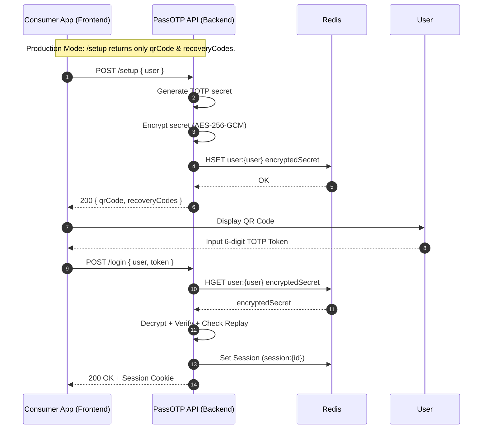
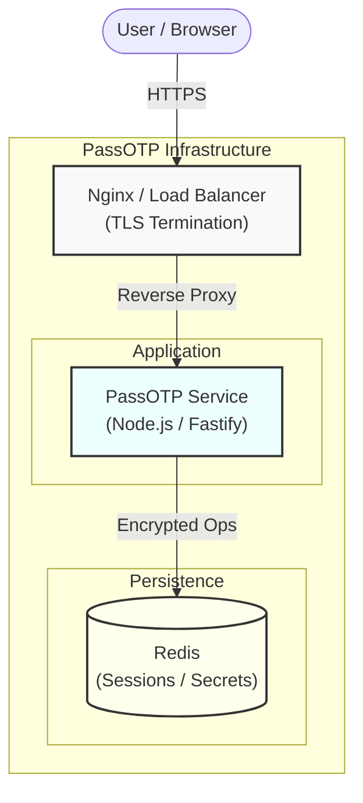

# PassOTP 🛡️
> **Secure Multi-Factor Authentication Infrastructure (Self-Hosted)**
>
> PassOTP allows you to add TOTP (Authenticator Apps) and WebAuthn (Passkeys) to your application without implementing low-level cryptography. It runs as a private microservice acting as the authoritative source for second-factor validation.

[](README.pt-br.md)
[](README.md)

- **Standards Compliance**: Strictly follows RFC 6238 (TOTP) and FIDO2 (WebAuthn) specifications.
- **Hardened Security**: Features AES-256-GCM encryption at-rest, atomic replay protection via Redis, and rate-limiting by IP/User.
- **Data Sovereignty**: Secrets never leave your infrastructure; you retain full control over user data and access logs.
- **Drop-in Architecture**: Stateless Node.js API container designed for zero-downtime deployment in Docker or Kubernetes environments.

[](docker-compose.yml)
[](src/server.ts)
[](src/services/encryption.service.ts)
[](LICENSE)

---

## Architecture & Design Goals

Implementing MFA correctly requires handling significant complexity beyond token generation. PassOTP addresses these system-level challenges:

- **Secret Management**: Does not store secrets in plain text. Uses AES-256-GCM encryption before persistence.
- **Replay Protection**: Prevents token reuse within the validity window using atomic Redis operations (`SET NX`).
- **Brute-Force Mitigation**: Enforces rate limits on verification attempts per IP and per user account to prevent credential stuffing.
- **Session Security**: Manages secure, HttpOnly sessions post-verification.

PassOTP is designed to be the single responsibility service for 2FA, decoupling authentication logic from your main application monolith.

## Security Model

PassOTP implements a defense-in-depth strategy.

- **Threat Model**: See [SECURITY.md](SECURITY.md) for details on how we mitigate Brute Force, Replay Attacks, and Enumeration.
- **Architecture Decisions**:
  - [ADR-001: Stateless Redis Architecture](docs/adr/001-stateless-architecture.md)
  - [ADR-002: Secret Encryption (AES-256)](docs/adr/002-secret-encryption.md)
  - [ADR-003: WebAuthn Policy](docs/adr/003-webauthn-policy.md)

---

## Technical Features

- **Encryption at Rest**: TOTP secrets are encrypted using `AES-256-GCM` with unique IVs.
- **Replay Attack Prevention**: Utilizing Redis guarantees atomic checks to invalidate used tokens immediately.
- **Rate Limiting strategy**:
    - **IP-based**: Throttling to mitigate DDoS attempts.
    - **User-based**: Throttling to mitigate targeted attacks on specific accounts.
- **Privacy Controls**: Constant-time responses where possible to mitigate timing attacks; minimal logging of sensitive data.
- **WebAuthn Support**: Enforces User Verification (UV) by default in production configurations (Biometrics/PIN required).

---

## Quickstart (Deployment)
 
 🚀 **Ready for Production?** Choose your deployment path:
 
 [](DEPLOY_K8S.md)
 [](DEPLOY_DOCKER.md)
 
 ### Local Development (Quick Run)
 
 This guide assumes a Docker and Docker Compose environment for a quick local test.
 
 1.  **Clone and Configure**:
     ```bash
     git clone https://github.com/tr0drigues/passotp.git
     cd passotp
     cp .env.example .env
     # Edit .env to set your ENCRYPTION_KEY (32 bytes) and secure secrets
     ```

2.  **Start Services**:
    ```bash
    docker-compose up -d --build
    ```

3.  **Verification**:
    Access **http://localhost** to view the included demo UI.
    - Register a test user (`user@test.com`).
    - Scan the QR Code with an Authenticator App (e.g., Google Authenticator).
    - Validate the login flow with the generated code.

---

## Integration Guide

Your application ("Consumer App") communicates with PassOTP via its internal REST API.

### Production Flow
In a production environment, PassOTP handles the generation, storage, and validation of factors.



**Security Note**: The TOTP secret is never exposed to the client or the consumer application after the initial setup.

### API Endpoints

#### `POST /setup`
Initializes MFA for a user.
- **Input**: `{ "user": "string" }`
- **Output**: `{ "qrCode": "data:image/...", "recoveryCodes": [...] }`

#### `POST /login`
Validates a TOTP token or Recovery code.
- **Input**: `{ "user": "string", "token": "string" }`
- **Output**: `{ "success": true, "meta": { ... } }` (Sets `HttpOnly` cookie)

---

## Trade-offs & Comparisons

PassOTP is a specialized microservice. Consider the following trade-offs when selecting a solution.

### vs. Libraries (`otplib`, `speakeasy`)
| Feature | Libraries | PassOTP Scheme |
| :--- | :--- | :--- |
| **Scope** | Helper functions (generate/verify) | Full System (State, API, Persistence) |
| **Security** | Implementation dependent | Enforced (Encryption, Replay protection) |
| **Operational Overhead** | Low (code only) | Medium (requires Redis/Docker) |

### vs. IAM Suites (`Keycloak`, `Authentik`)
| Feature | IAM Suites | PassOTP |
| :--- | :--- | :--- |
| **Capability** | Full Identity Management (SSO, OIDC) | Focused purely on 2FA/MFA |
| **Complexity** | High (Heavy resources, complex config) | Low (Single container, simple REST API) |
| **Integration** | OIDC/SAML Protocols | REST / Direct API |

### vs. SaaS (`Auth0`, etc.)
| Feature | SaaS | PassOTP |
| :--- | :--- | :--- |
| **Cost Model** | User/Volume based | Infrastructure (Compute/Memory) |
| **Data Control** | Vendor Managed | Self-hosted / Private |
| **Maintenance** | Minimal | Requires self-hosting updates |

**Recommendation**: Use PassOTP if you need a lightweight, self-hosted 2FA layer without the overhead of a full Identity Provider (IdP).

---

## Development vs. Production

The application behavior changes based on environment variables to support testing while securing production.

| Variable | Default (Prod) | Impact |
| :--- | :--- | :--- |
| `ALLOW_DEBUG_SETUP_OUTPUT` | `false` | If `true`, returns the raw secret in `/setup` response (Debug only). |
| `ENABLE_DEV_VERIFY_ENDPOINT`| `false` | If `true`, enables a `/verify` endpoint for integration testing. |
| `WEBAUTHN_REQUIRE_UV` | `true` | If `false`, allows WebAuthn registration without rigorous user verification (e.g., for testing). |

---

## Production Checklist

Before deploying to a public environment, verify the following:

- [ ] **HTTPS Enforced**: Ensure SSL/TLS termination is handled by Nginx or your Load Balancer.
- [ ] **Environment**: Set `NODE_ENV=production`.
- [ ] **Secrets Rotation**: Generate a strong (32-byte) `ENCRYPTION_KEY` and robust `SESSION_SECRET`.
- [ ] **CORS Policy**: Restrict `FRONTEND_ORIGIN` to your specific domain.
- [ ] **WebAuthn Policy**: Verify `WEBAUTHN_REQUIRE_UV=true` is set.

---

## Infrastructure Overview



## License
MIT
