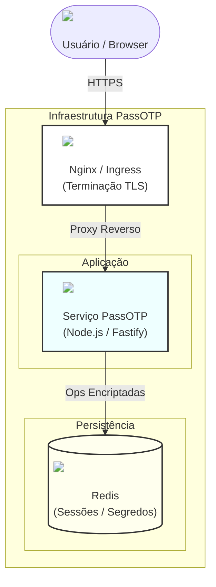
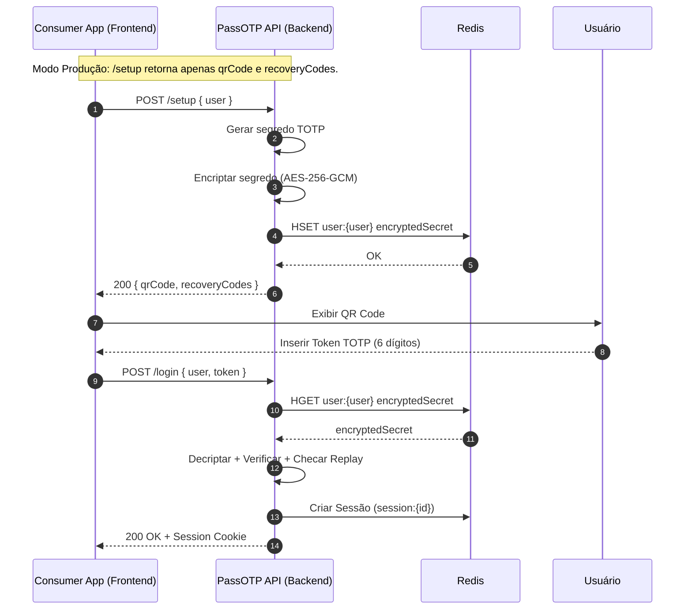

# PassOTP 🛡️
> **Infraestrutura de Autenticação Multifator Segura (Self-Hosted)**
>
> O PassOTP permite adicionar TOTP (Apps Autenticadores) e WebAuthn (Passkeys) à sua aplicação sem implementar criptografia de baixo nível. Ele roda como um microserviço privado, atuando como a fonte autoritativa para validação de segundo fator.

[](README.pt-br.md)
[](README.md)

- **Conformidade com Padrões**: Segue estritamente as especificações RFC 6238 (TOTP) e FIDO2 (WebAuthn).
- **Segurança Reforçada**: Criptografia AES-256-GCM em repouso, proteção atômica contra replay via Redis e rate-limiting por IP/Usuário.
- **Soberania de Dados**: Os segredos nunca saem da sua infraestrutura; você mantém controle total sobre os dados dos usuários e logs de acesso.
- **Arquitetura Drop-in**: Container de API Node.js stateless projetado para deploy sem downtime em Docker ou Kubernetes.

[](docker-compose.yml)
[](src/server.ts)
[](src/services/encryption.service.ts)
[](LICENSE)

---

## Visão Geral da Infraestrutura



## Arquitetura e Objetivos de Design

Implementar MFA corretamente exige lidar com complexidade significativa além da geração de tokens. O PassOTP resolve estes desafios sistêmicos:

- **Gerenciamento de Segredos**: Não armazena segredos em texto plano. Utiliza criptografia AES-256-GCM antes da persistência.
- **Proteção contra Replay**: Impede a reutilização de tokens dentro da janela de validade usando operações atômicas no Redis (`SET NX`).
- **Mitigação de Força Bruta**: Impõe limites de taxa (rate limits) em tentativas de verificação por IP e por conta de usuário para evitar credential stuffing.
- **Segurança de Sessão**: Gerencia sessões seguras e HttpOnly após a verificação.

O PassOTP foi projetado para ser o serviço de responsabilidade única para 2FA, desacoplando a lógica de autenticação do monólito da sua aplicação principal.

## Modelo de Segurança

O PassOTP implementa uma estratégia de defesa em profundidade.

- **Modelo de Ameaças**: Veja [SECURITY.md](SECURITY.md) (em inglês) para detalhes de como mitigamos Força Bruta, Ataques de Replay e Enumeração.
- **Decisões de Arquitetura**: Projetado como uma API Stateless com backing no Redis (App Stateless + Dados Stateful). Segredos encriptados com AES-256-GCM. WebAuthn exige Verificação de Usuário.

---

## Recursos Técnicos

- **Criptografia em Repouso**: Segredos TOTP são encriptados usando `AES-256-GCM` com IVs únicos.
- **Prevenção de Ataques de Replay**: Utiliza o Redis para garantir checagens atômicas e invalidar tokens usados imediatamente.
- **Estratégia de Rate Limiting**:
    - **Baseada em IP**: Throttling para mitigar tentativas de DDoS.
    - **Baseada em Usuário**: Throttling para mitigar ataques direcionados a contas específicas.
- **Controles de Privacidade**: Respostas em tempo constante onde possível para mitigar timing attacks; log mínimo de dados sensíveis.
- **Suporte a WebAuthn**: Exige Verificação de Usuário (UV) por padrão em configurações de produção (Biometria/PIN necessários).

---

## Quickstart (Deploy)
 
 🚀 **Pronto para Produção?** Escolha seu caminho de deploy:
 
 [](DEPLOY_K8S.md)
 [](DEPLOY_DOCKER.md)
 
 ### Desenvolvimento Local (Teste Rápido)
 
 Este guia assume um ambiente com Docker e Docker Compose para um teste rápido local.
 
 1.  **Clone e Configure**:
     ```bash
     git clone https://github.com/tr0drigues/passotp.git
     cd passotp
     cp .env.example .env
     # Edite o .env para definir sua ENCRYPTION_KEY (32 bytes) e segredos seguros
     ```

2.  **Inicie os Serviços**:
    ```bash
    docker-compose up -d --build
    ```

3.  **Verificação**:
    Acesse **http://localhost** para ver a UI de demonstração incluída.
    - Cadastre um usuário de teste (`user@test.com`).
    - Escaneie o QR Code com um App Autenticador (ex: Google Authenticator).
    - Valide o fluxo de login com o código gerado.

---

## Guia de Integração

Sua aplicação ("Consumer App") se comunica com o PassOTP através de sua API REST interna.

### Fluxo de Produção
Em um ambiente de produção, o PassOTP lida com a geração, armazenamento e validação dos fatores.



**Nota de Segurança**: O segredo TOTP nunca é exposto ao cliente ou à aplicação consumidora após o setup inicial.

### Endpoints da API

#### `POST /setup`
Inicializa o MFA para um usuário.
- **Input**: `{ "user": "string" }`
- **Output**: `{ "qrCode": "data:image/...", "recoveryCodes": [...] }`

#### `POST /login`
Valida um token TOTP ou código de Recuperação.
- **Input**: `{ "user": "string", "token": "string" }`
- **Output**: `{ "success": true, "meta": { ... } }` (Define cookie `HttpOnly`)

---

## Trade-offs e Comparações

O PassOTP é um microserviço especializado. Considere os seguintes trade-offs ao selecionar uma solução.

### vs. Bibliotecas (`otplib`, `speakeasy`)
| Recurso | Bibliotecas | PassOTP |
| :--- | :--- | :--- |
| **Escopo** | Funções auxiliares (gerar/verificar) | Sistema Completo (Estado, API, Persistência) |
| **Segurança** | Depende da implementação | Forçada (Criptografia, Proteção contra Replay) |
| **Custo Operacional** | Baixo (apenas código) | Médio (requer Redis/Docker) |

### vs. Suítes IAM (`Keycloak`, `Authentik`)
| Recurso | Suítes IAM | PassOTP |
| :--- | :--- | :--- |
| **Capacidade** | Gestão Completa de Identidade (SSO, OIDC) | Focado puramente em 2FA/MFA |
| **Complexidade** | Alta (Recursos pesados, config complexa) | Baixa (Container único, API REST simples) |
| **Integração** | Protocolos OIDC/SAML | REST / API Direta |

### vs. SaaS (`Auth0`, etc.)
| Recurso | SaaS | PassOTP |
| :--- | :--- | :--- |
| **Modelo de Custo** | Baseado em Usuário/Volume | Infraestrutura (Compute/Memory) |
| **Controle de Dados** | Gerenciado pelo Vendor | Self-hosted / Privado |
| **Manutenção** | Mínima | Requer atualizações self-hosted |

**Recomendação**: Use o PassOTP se você precisa de uma camada de 2FA leve e self-hosted sem o overhead de um Provedor de Identidade (IdP) completo.

---

## Desenvolvimento vs. Produção

O comportamento da aplicação muda com base em variáveis de ambiente para suportar testes enquanto protege a produção.

| Variável | Padrão (Prod) | Impacto |
| :--- | :--- | :--- |
| `ALLOW_DEBUG_SETUP_OUTPUT` | `false` | Se `true`, retorna o segredo cru na resposta do `/setup` (Apenas Debug). |
| `ENABLE_DEV_VERIFY_ENDPOINT`| `false` | Se `true`, habilita um endpoint `/verify` para testes de integração. |
| `WEBAUTHN_REQUIRE_UV` | `true` | Se `false`, permite registro WebAuthn sem verificação rigorosa de usuário (ex: para testes). |

---

## Checklist de Produção

Antes de fazer o deploy para um ambiente público, verifique o seguinte:

- [ ] **HTTPS Forçado**: Garanta que a terminação SSL/TLS seja feita pelo Nginx ou seu Load Balancer.
- [ ] **Ambiente**: Defina `NODE_ENV=production`.
- [ ] **Rotação de Segredos**: Gere um `ENCRYPTION_KEY` forte (32 bytes) e um `SESSION_SECRET` robusto.
- [ ] **Política de CORS**: Restrinja `FRONTEND_ORIGIN` ao seu domínio específico.
- [ ] **Política WebAuthn**: Verifique se `WEBAUTHN_REQUIRE_UV=true` está definido.

---


## Licença
MIT
